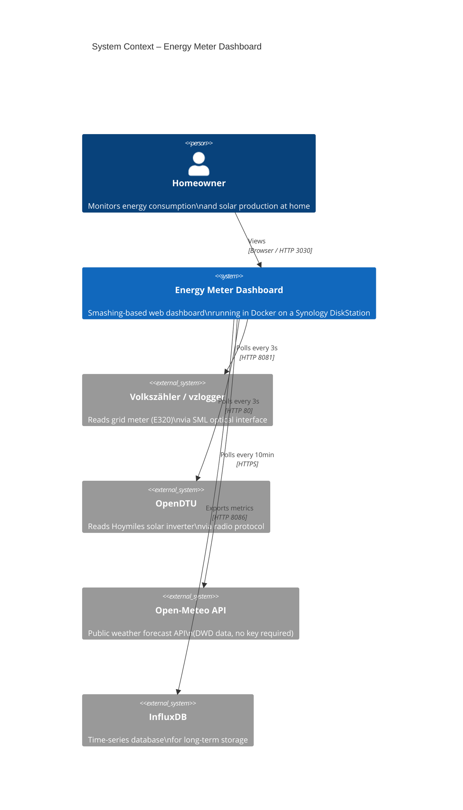
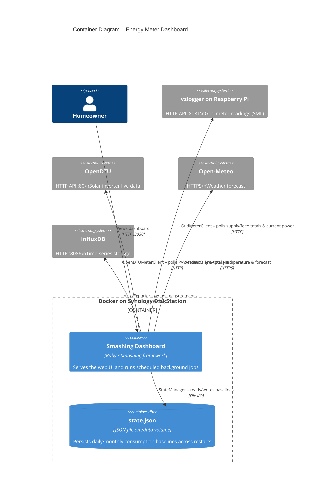

# Energy Meter Dashboard

[](https://github.com/daisaja/energymeterdashboard/actions/workflows/docker.yml)
[](https://github.com/daisaja/energymeterdashboard/actions/workflows/codeql-analysis.yml)
[](https://sonarcloud.io/summary/new_code?id=daisaja_energymeterdashboard)
[](https://sonarcloud.io/summary/new_code?id=daisaja_energymeterdashboard)
[](https://sonarcloud.io/summary/new_code?id=daisaja_energymeterdashboard)

Check out http://smashing.github.io/smashing for more information.

## Docker

Run docker with:

```bash
docker run -p3030:3030 --env-file .env daisaja/energymeter:latest
```

Build and push:

```bash
docker build -t daisaja/energymeter:latest .
docker push daisaja/energymeter:latest
```

SMA firmware: 2.13.33.R / 3.10.10.R

# Copy ssd image

sudo fdisk -l

sudo mount | grep sdc
sudo umount /dev/sdc1

~/Downloads/volkszaehler_latest$ sudo dd if=./2019-07-07-volkszaehler_raspian_buster.img | pv -s 8G | sudo dd of=/dev/sdc bs=1M


## Architecture

### System Context



### Container Diagram



### Component Diagram

```mermaid
C4Component
  title Component Diagram – Smashing Dashboard

  Person(user, "Homeowner")

  Container_Boundary(smashing, "Smashing Dashboard (Docker / Synology DiskStation)") {
    Component(webserver, "Web Server", "Smashing / Sinatra", "Serves dashboard UI on port 3030")

    Component(grid_jobs, "Grid Jobs", "Ruby / Scheduler", "Current grid power (2s), daily and monthly consumption, energy summary (3s)")
    Component(solar_jobs, "Solar Jobs", "Ruby / Scheduler", "Current PV power and daily yield (2s)")
    Component(heating_jobs, "Heating Jobs", "Ruby / Scheduler", "Current heating power and daily consumption (2s)")
    Component(weather_job, "Weather Job", "Ruby / Scheduler", "Current weather and 2-day forecast (10min)")

    Component(grid_client, "GridMeterClient", "Ruby / HTTParty", "Fetches grid supply/feed totals and current power from vzlogger")
    Component(opendtu_client, "OpenDTUMeterClient", "Ruby / HTTParty", "Fetches PV power, daily and total yield from OpenDTU")
    Component(solar_client, "SolarMeterClient", "Ruby / HTTParty", "Fetches PV power from SMA inverter")
    Component(heating_client, "HeatingMeterClient", "Ruby / HTTParty", "Fetches heating power and kWh values from YouLess")
    Component(weather_client, "WeatherClient", "Ruby / HTTParty", "Fetches weather data from Open-Meteo API")

    Component(influx_exporter, "InfluxExporter", "Ruby / influxdb-client", "Writes time-series measurements to InfluxDB")
    Component(state_manager, "StateManager", "Ruby / JSON", "Persists and restores daily/monthly consumption baselines")
  }

  System_Ext(vzlogger, "vzlogger", "Raspberry Pi / HTTP :8081")
  System_Ext(opendtu, "OpenDTU", "HTTP :80")
  System_Ext(sma, "SMA Inverter", "HTTP")
  System_Ext(youless, "YouLess", "HTTP")
  System_Ext(openmeteo, "Open-Meteo", "HTTPS")
  System_Ext(influxdb, "InfluxDB", "HTTP :8086")
  ContainerDb(statefile, "state.json", "JSON / /data volume")

  Rel(user, webserver, "Views dashboard", "HTTP :3030")

  Rel(grid_jobs, grid_client, "Uses")
  Rel(grid_jobs, state_manager, "Reads/writes baselines")
  Rel(grid_jobs, influx_exporter, "Reports grid watts")

  Rel(solar_jobs, opendtu_client, "Uses")
  Rel(solar_jobs, solar_client, "Uses")
  Rel(solar_jobs, influx_exporter, "Reports solar watts")

  Rel(heating_jobs, heating_client, "Uses")
  Rel(heating_jobs, influx_exporter, "Reports heating watts")

  Rel(weather_job, weather_client, "Uses")

  Rel(grid_client, vzlogger, "Polls every 2s", "HTTP")
  Rel(opendtu_client, opendtu, "Polls every 2s", "HTTP")
  Rel(solar_client, sma, "Polls every 2s", "HTTP")
  Rel(heating_client, youless, "Polls every 2s", "HTTP")
  Rel(weather_client, openmeteo, "Polls every 10min", "HTTPS")
  Rel(influx_exporter, influxdb, "Writes measurements", "HTTP")
  Rel(state_manager, statefile, "Reads/writes", "File I/O")
```


